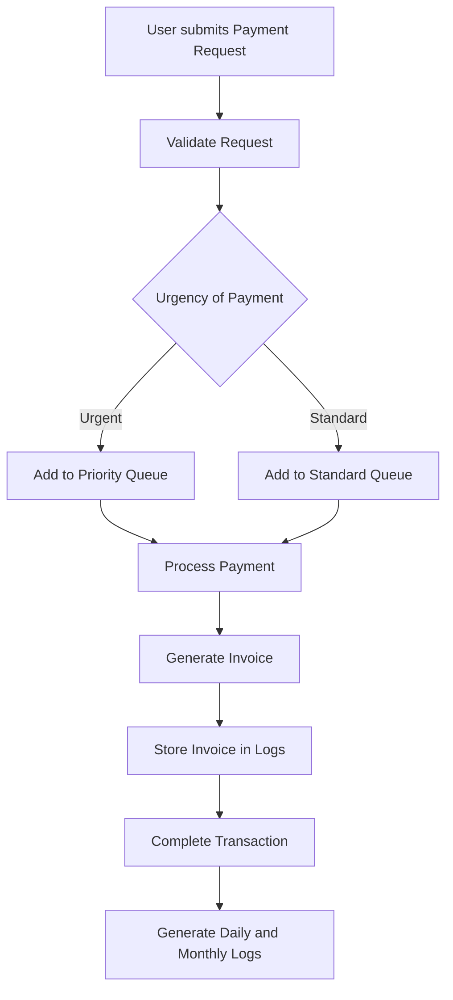

---

# Utility Bill Payment System

A project designed to streamline and optimize the utility bill payment process for the residents of Mangalore. The system uses efficient data structures to process payments, handle urgent requests, track transactions, and generate invoices for essential services like electricity, water, and gas.

## Problem Statement

Mangalore’s citizens often face challenges with timely utility bill payments due to inefficient systems. This project addresses these issues by designing a solution that:
- Processes standard and urgent payment requests using a queue-based system.
- Prioritizes critical payments to avoid service disconnections.
- Tracks historical transactions and allows for error correction through undo functionality.
- Logs daily and monthly transactions for auditing purposes.

## Key Features

- **Queue Management**: Handles standard and priority queues to process payments based on urgency.
- **Transaction Tracking**: Uses stacks to track user transactions, allowing users to view and undo recent payments.
- **Automated Invoicing**: Generates a PDF invoice for each payment and stores it for easy retrieval.
- **Daily and Monthly Logging**: Logs transactions in JSON format for daily and monthly auditing.

## System Requirements

To set up and run this project, you will need:
- **Node.js** (v14 or higher)
- **Express** (Web framework for Node.js)
- **Joi** (Data validation library for request validation)
- **PDFKit** (Library to generate PDF invoices)
- **File System (fs)** (for file handling in Node.js)

## Project Structure

- **server.js**: Sets up the Express server and defines API endpoints.
- **config.js**: Configures environment variables like port and log file paths.
- **invoiceGenerator.js**: Generates PDF invoices for completed transactions.
- **paymentQueue.js**: Manages standard and priority queues for payment processing.
- **transactionStack.js**: Tracks and stores transactions, with the ability to undo them.

## System Flowchart



## Backend Workflow

1. **Payment Submission**: User submits a payment request to the `/pay-bill` endpoint.
2. **Request Validation**: Validates the request using Joi to ensure all necessary fields are present.
3. **Queue Management**: Adds request to a priority queue if marked urgent, otherwise adds it to a standard queue.
4. **Payment Processing**: Processes the request and generates an invoice.
5. **Transaction Logging**: Logs the transaction in daily and monthly files for record-keeping and auditing.

## API Endpoints

### `/pay-bill` (POST)
Submits a new payment request. The system validates the data and places the request in the appropriate queue.

### `/invoices/:userId` (GET)
Retrieves all invoices for a specific user ID.

### `/undo-transaction/:userId` (POST)
Undoes the most recent transaction for the specified user.

## How to Run the Project

1. Clone the repository.
2. Install the dependencies:
   ```bash
   npm install
   ```
3. Set up environment variables in a `.env` file:
   ```plaintext
   PORT=3000
   DAILY_LOG_FILE_PATH=logs/daily_transactions.json
   MONTHLY_LOG_DIR=logs/monthly/
   INVOICE_DIR=invoices/
   ```
4. Start the server:
   ```bash
   node server.js
   ```

## Conclusion

The Utility Bill Payment System provides Mangalore residents with a reliable and efficient solution to manage utility payments. The project’s structure ensures timely processing of critical payments, offers a history tracking system for user accountability, and creates comprehensive audit logs for utility providers.

## References

1. [Node.js Documentation](https://nodejs.org/en/docs/)
2. [Express.js Documentation](https://expressjs.com/)
3. [Joi Documentation](https://joi.dev/api/)
4. [PDFKit Documentation](https://pdfkit.org/)

---